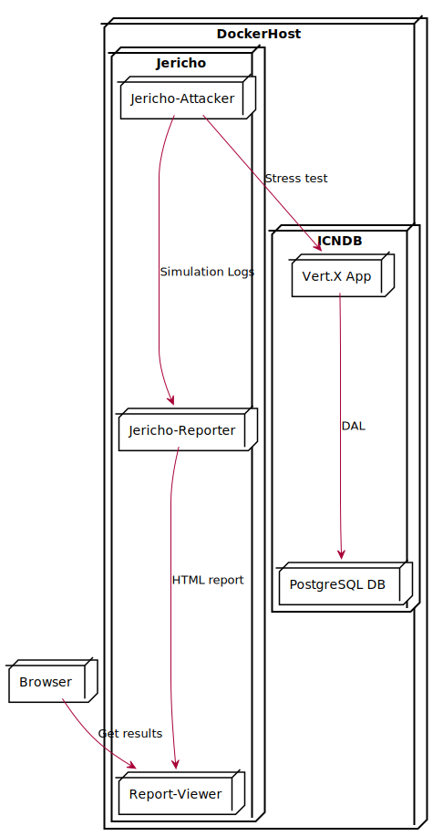

# SA-Jericho

[](https://travis-ci.org/baez90/SA-Jericho)

## What is Jericho?

Jericho is Gatling in Docker containers.
Why it is called Jericho? You know...everything needs a name and Jericho sounds cool, doesn't it?

Jericho is designed to scale out by running multiple containers.
It consists of 3 parts:

* [Jericho Attacker](https://hub.docker.com/r/baez90/jericho-attacker/)
* [Jericho Reporter](https://hub.docker.com/r/baez90/jericho-reporter/)
* and a reports viewer (in the docker-compose file implemented by the default nginx container)



# ICNDB clone

The repository contains a demo application as test case for the Jericho.
It's a clone of the **I**nternet **C**huck **N**orris **D**ata**b**ase (ICNDB).

The easiest way to start the ICNDB is starting the [docker-compose.yml](./docker-compose.yml) file.
It defines the required PostgreSQL database service and configures both services through environment variables.

The ICNDB clone is also available as [Docker image](https://hub.docker.com/r/baez90/jericho-victim/).

# Jericho

## Jericho Attacker

The Dockerfile for the attacker image is located under _JerichoGatling/2.3.0-attacker/_.
The folder contains the script [attack.sh](./JerichoGatling/2.3.0-attacker/attack.sh) which controls the attack node.

When the attack node is started, the _attack.sh_ script is started and starts a Gatling process with a few parameters. The following options are set:

* _-nr_ to disable the generation of an HTML report on the attack node
* _on_ to rename the output directory to the hostname (id) of the container
* _-m_ to suppress required inputs

The _-m_-Switch requires that in the folder _/opt/gatling/user-files/simulations_ is just **one** simulation file!

### Simulation files

#### Docker-Compose

If you're running Jericho within Docker-Compose you can just mount your simulation file to the folder _/opt/gatling/user-files/simulations_ and thats it!

#### Docker Swarm

If you want to run Jericho within Docker Swarm the easiest way to get a simulation file into all attack nodes is to create a config file (`docker config create <name> <path/to/file>`) and mount the configuration afterwards into the attack nodes.
That can be accomplished like in the given _docker-compose-attacker-stack.yml_:

```yaml
configs:
    - source: RandomJokeSimulation
      target: /opt/gatling/user-files/simulations/RandomJokeSimulation.scala
```

remember to declare the config variable in the global scope of the file:

```yaml
configs:
  RandomJokeSimulation:
    external: true
```

### Shared volumes

Jericho needs some shared volumes:

* One volume shared between the attack nodes and the reporter to get the gatling simulation logs to the reporter
* One volume shared between the reporter node and the report viewer to get the generated HTML report into a web root folder

The volume shared between attack nodes and reporter (let's call it _gatling-logs_) has to be mounted to the folder _/opt/gatling/shared-results_ on all attack nodes and to the folder _/opt/gatling/results_ on the reporter node. There's a special folder _shared-results_ because the log files have to be renamed before they're getting shared to avoid filename conflicts resulting in loosing results from one node.

The volume shared between the reporter node and the report viewer has to be mounted to the folder _/opt/gatling/html-out_ on the reporter node and to the folder _/usr/share/nginx/html_ if you're using nginx as web server.

#### Docker-Compose

If you want to run Jericho within Docker-Compose you'll have no problems by just declaring the volumes in the global scope of your Docker-Compose file:

```yaml
volumes:
  gatling-logs:
  gatling-results:
```

Because the containers are running on the same host, the "in memory" volumes are shared across all containers.

#### Docker Swarm

If you want to run Jericho within Docker Swarm you have 2 options:

* run all containers on the same node (e.g. placement constraints on a node id or a master node if you have just one)
* create volumes which are shared across all hosts (in the sample Stack config this is accomplished by declaring NFS volumes)